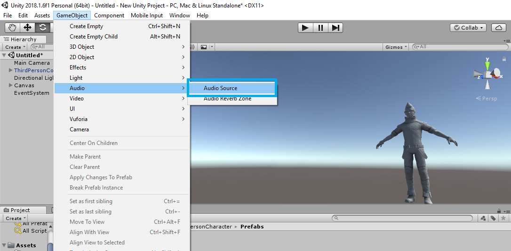
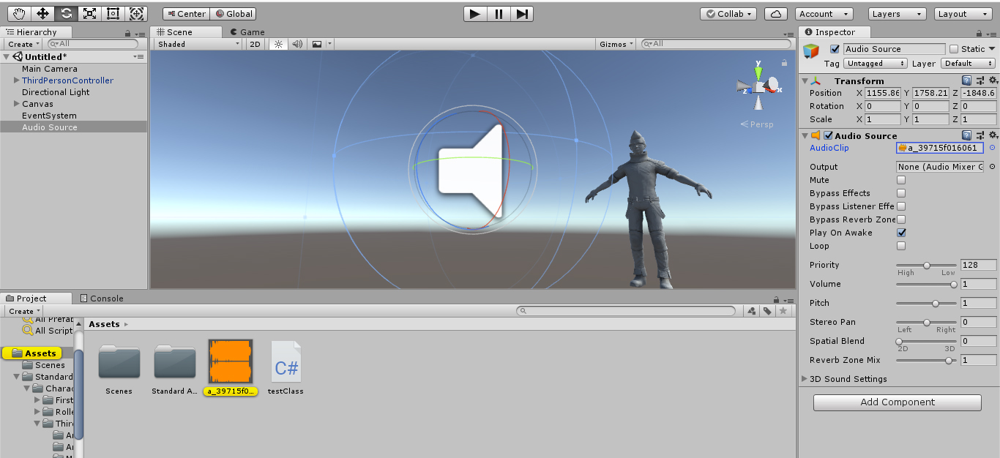
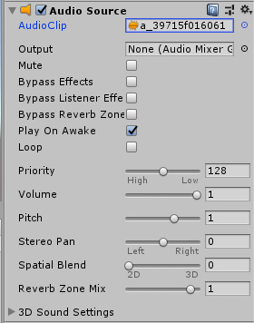

# Audio

To add Audio to your scene, Click on GameObject Tab &gt; Audio &gt; Audio Source 

Unity then creates an Audio Source onto your Hierarchy window and your scene.

You can import your audio into your Assets folder and you can drag the audio file onto the " Audio Clip" field. in the inspector window, when you have the Audio Source selected.

You can adjust the properties on the Inspector window. You can adjust volume, pitch, stereo path and much more.

You can have all kinds of audio in a scene, background music, environmental sounds\( bird chirps, river flowing etc\), button clicks etc. Audio is very important for Virtual Reality. You need to have audio feedback for every interaction, everything in a scene. 

