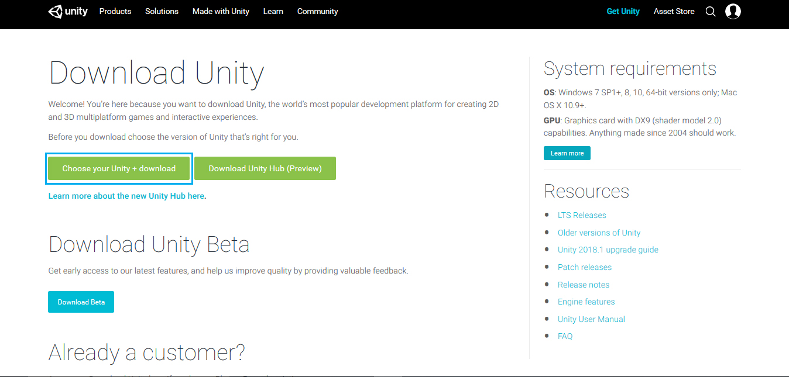

# Installing Unity3D Software

## Download Unity3D

You can download Unity3D Software from the [Unity Download page](https://unity3d.com/get-unity/download?_ga=2.4811441.364722446.1530540963-1720237505.1507147097). This page gives you the link to download the Unity Installer which will download the Unity Software.

It is recomended that you use a computer running Windows 7 or higher \(64 bit only \) on an i5 or i7 processor \( i3 works but you may have performance issues \) with atleast 4GB RAM.

Unity is completely free to use for beginners, students and hobbyists so go ahead and choose " Personal " version of Unity. 

Download the Installer for Windows if you are using a Windows Machine

Now Click and open the downloaded file and start the installation. Make sure you are connected to the internet at all times until the download and  setup is complete.  
  
Make sure that you have checked the unity components as shown in the image below.

### Setting up Unity Software

After the installation is complete, Open Unity3d.

You will have to create a free account, if this is the first time you are installing unity. To create one, just click on the **create one** like in the image below.

Once you have created an account, logged into unity, the new project window pops up.


Your laptop must be connected to Internet when you creating your unity account. 


Click on New Project.

Give a name to your new project and make sure the Template is set to 3D and Click on Create Project.

Once you see something like this, your installation of Unity3d is complete.


## Reference Videos - Installing Unity

* [Windows Installation](https://www.youtube.com/watch?v=vzSAZozZz5I)
* [Mac Installation ](https://www.youtube.com/watch?v=YC3924upas8)
* [Linux Installation](https://www.youtube.com/watch?v=TCSGa3V78hg)



To Do \(A Summarize To-Do list for Students\)

* [ ] Downloading Unity
* [ ] Installing Unity



Got Struck??? Post your Query in this [Facebook Group](https://www.facebook.com/groups/soi.vr/)


