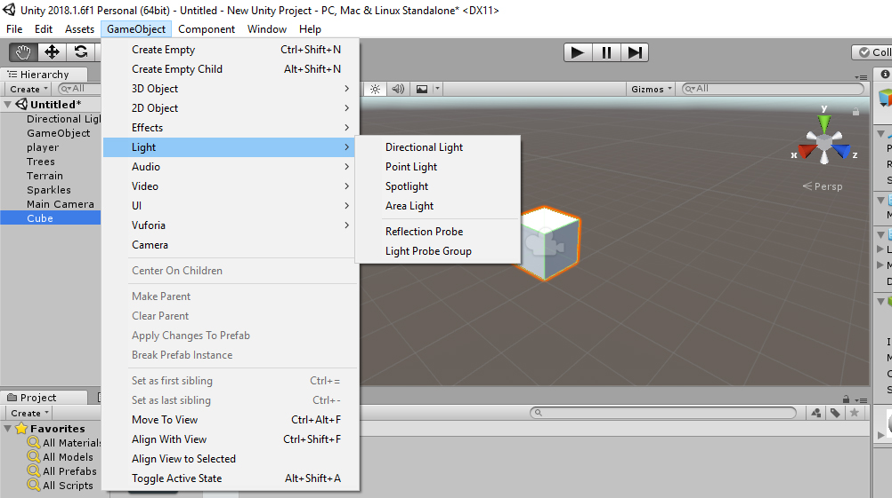

# Lighting

You can add light to any scene by Selecting GameObject &gt; Light &gt; -- and select the lighting of your choice.

### Types of Light

#### Point Light : 

 A point light is located at a point in space and sends light out in all directions equally.

 Point lights are useful for simulating lamps and other local sources of light in a scene. You can also use them to make a spark or explosion illuminate its surroundings in a convincing way.

#### Spotlight: 

 Like a point light, a spot light has a specified location and range over which the light falls off. However, the spot light is constrained to an angle, resulting in a cone-shaped region of illumination.

 Spot lights are generally used for artificial light sources such as flashlights, car headlights and searchlights. With the direction controlled from a script or animation, a moving spot light will illuminate just a small area of the scene and create dramatic lighting effects.

#### Directional Community

 Directional lights are very useful for creating effects such as sunlight in your scenes. Behaving in many ways like the sun, directional lights can be thought of as distant light sources which exist infinitely far away.

 Directional lights represent large, distant sources that come from a position outside the range of the game world. In a realistic scene, they can be used to simulate the sun or moon. In an abstract game world, they can be a useful way to add convincing shading to objects without exactly specifying where the light is coming from.


Got Struck??? Post your Query in this [Facebook Group](https://www.facebook.com/groups/soi.vr/)



## Video Reference

* [Understanding Unity Lighting ](https://www.youtube.com/watch?v=VnG2gOKV9dw)


