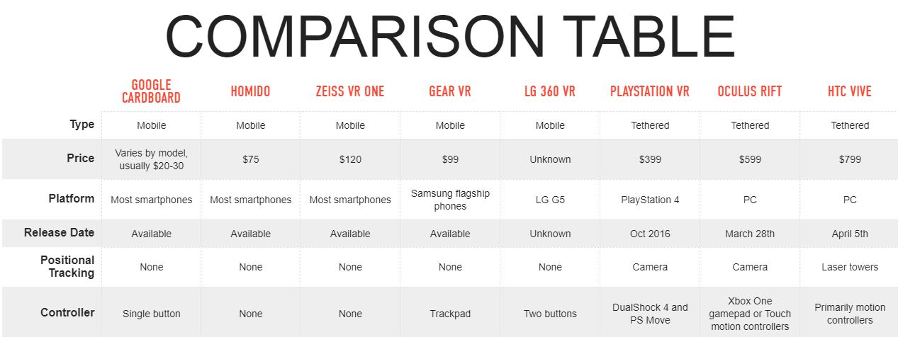

# Types of VR

Broadly, VR can be classified based on its type of immersion and the type of device you intend to use. 

Based on Type of Immersion, VR can be categorized broadly as :   
1. 360 Degree Media and  
2. Computer Generated 3D VR \(CG3D VR\)

#### 360 Degree Media

These are basically 360 Degree Camera-shot images or videos or rendered scenes or images in 3D.

Camera shot 360 media enable you to experience or see a real-life place or scenario shot using a 360 degree camera. 

While a Rendered 360 Image or a video lets people experience images and scenes that were computer generated using any 3D application.

#### Computer Generated 3D VR

This is completely 3D immersive VR where you build a 3D space for the user to explore and interact with. 

## VR Devices

VR Devices can be broadly classified as :  
1. PC VR  
2. Mobile VR   
3. Standalone VR

#### PC VR

PC VR Headsets are headsets that provide the best possible VR experiences as of now. These headsets needs to be connected to a PC to be used. It utilizes the computer's graphics capabilities to render the VR experience in real-time.

Most of the PC VR Headsets can track your presence in the 3D Space, which means you can walk around in the 3D space like you walk in the real-world. 

Some of these Headsets are shown below:

**The Oculus Rift**

**HTC Vive**

**Playstation VR**

Playstation VR is the most famous VR headset and it connets only to a Playstation 4 \(PS4\)

#### Mobile VR

In 2011, when all the buzz about VR started coming in since the Oculus was announced, there was a general stigma that only people with high-end PCs can experince VR. 

But all that changed when Google came out with the Google Cardboard and showed everyone that you already have a VR capable device in your own hands - your Smartphone.  
Mobile phones, even though it may not be able to give you the quality of immersion the PC VR headsets can give you.

Some of these Mobile VR enablers are shown below :

**Google Cardboard**

**Samsung Gear VR**

**Google Daydream**

\*\*\*\*

**Standalone VR Headsets** 

Standalone VR headsets let you immerse yourself in VR without having to connect to a high-end PC or put a mobile phone inside a headset. 

Some of these headsets are shown below  

**HTC Vive Focus**  

**Lenovo Mirage Solo**

**Oculus Go**  

**Now lets check out how we would be building these VR experiences.**


## Reference Material

[THE ULTIMATE VR HEADSET BUYER’S GUIDE from The VERGE](https://www.theverge.com/a/best-vr-headset-oculus-rift-samsung-gear-htc-vive-virtual-reality)


