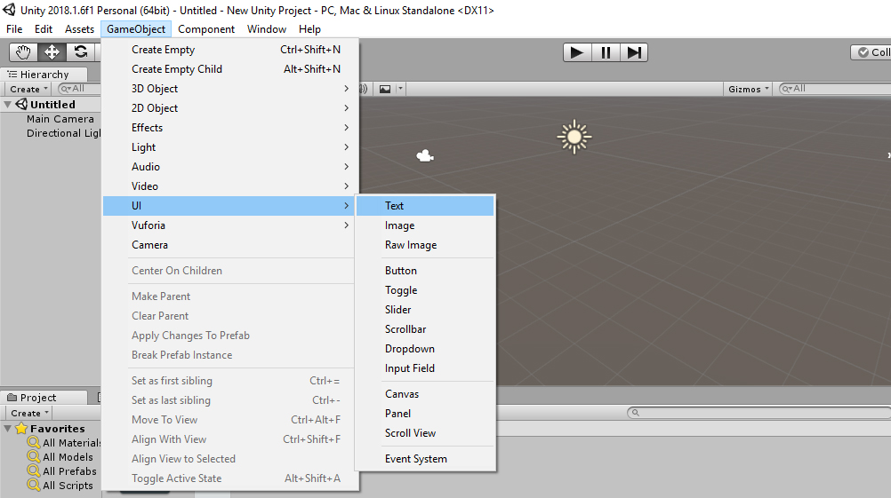
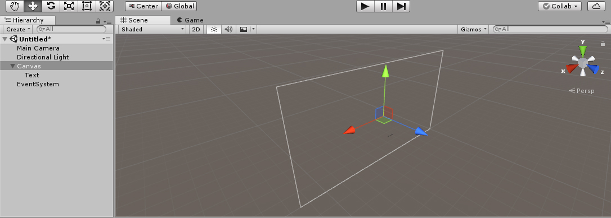
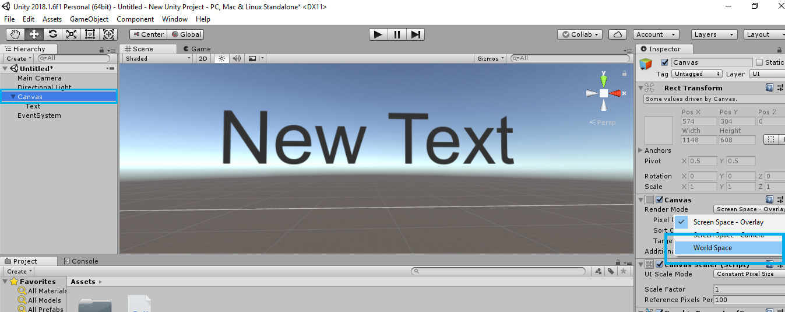
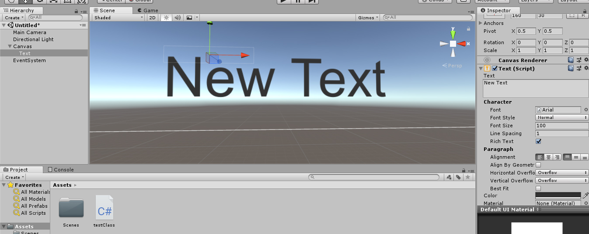

# Adding Text

### UI Text

To make UI text, Click on GameObject Tab &gt; UI &gt; Text 

 The **Text** control displays a non-interactive piece of text to the user. This can be used to provide captions or labels for other GUI controls or to display instructions or other text.

You will notice that unlike what happened in for the other objects we added, Text came as a child of a " Canvas" and another GameObject " Event System " has also appeared in the hierarchy window.

The **Canvas** is the area that all UI elements should be inside. The Canvas is a Game Object with a Canvas component on it, and all UI elements must be children of such a Canvas.

Always make sure that, in VR, it is always better if the UI elements are in the world space, where we can place objects in front or behind the Elements

And the Event System enables sending events to objects in the application based on input, be it keyboard, mouse, touch, or custom input, or in the case of VR, to the handheld controllers as well.

You can change the properties you wish to change for the text from the inspector window. Like, if you want to change font, alignment, size, weight, colour, etc.


Got Struck??? Post your Query in this [Facebook Group](https://www.facebook.com/groups/soi.vr/)



## Video Reference

* [Understanding Unity UI Text ](https://www.youtube.com/watch?v=wlY5sRewfVQ) 


