# Unity Primitives and Transform controls

### Primitives and Placeholder elements

Unity can work with any 3D models of any shape that can be created with a modelling software. But there are a few  primitive objects that can be created within Unity, namely Cube, Sphere, Capsule, Cylinder, Plane, Quad, etc. 

You can create any of these by selecting GameObject &gt; 3D Object &gt; --  
Or you can right-click on the hierarchy window &gt; 3D Object &gt; --

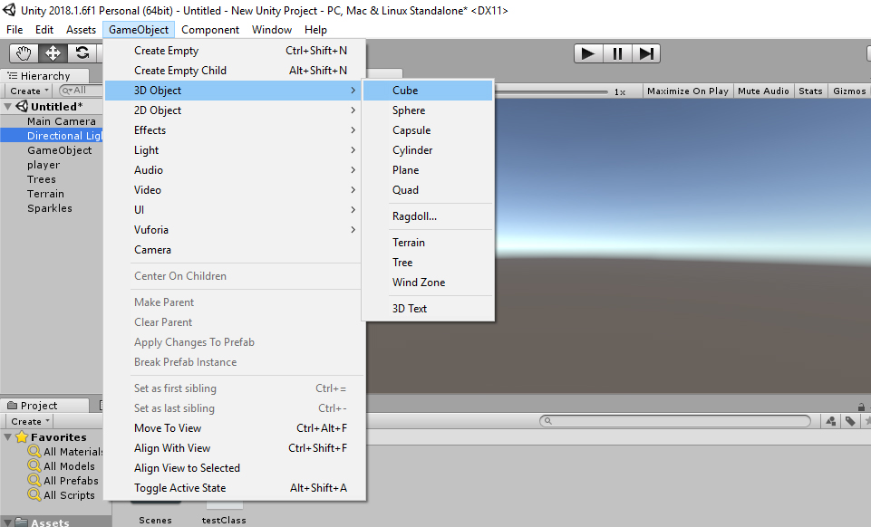

#### Cube

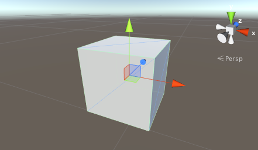

Creates a cube with each side 1 unit in length. It can be used as a box of any dimension or as a place holder for programmers to test mechanics.

#### Sphere

Creates a sphere of unit diameter \( radius - 0.5 units \)

#### Cylinder

This is a simple cylinder, 2 units tall and 1 unit wide.

#### Plane

This is a flat surface, 10 units long and placed on the xz plane of the local coordinate system.

#### Quad

The quad is a one unit long primitive, though it looks like the plane, it is smaller, renders 2 sides unlike the plane which renders only top side and is oriented in the local xy axis.

### Transform Controls

In order to test the Transform Controls, add a primitive object so you cant really test transform controls on an empty scene. 

You'll find the transform controls on the top-left corner of the Unity Editor. The first tool is the " **Hand Tool**".

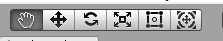

Select the Hand tool, then drag over the Scene view to pan the entire scene:

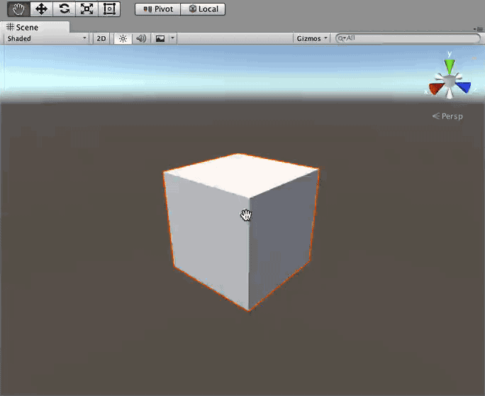

Right-click and drag to rotate the camera around your current position; notice that the hand icon transforms into an eye:

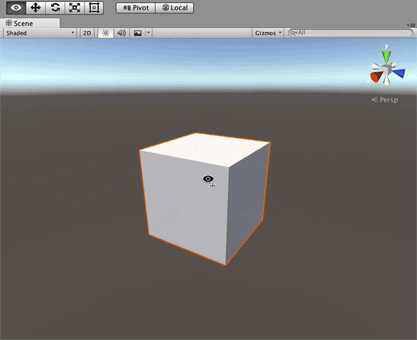

Next, hold down _Ctrl \(or Cmd\)_ and _Alt \(or Option\)_, right-click and move the mouse up to zoom into the scene. Moving the mouse down zooms out. Or if you want do it the easy way, just just use the scroll wheel:

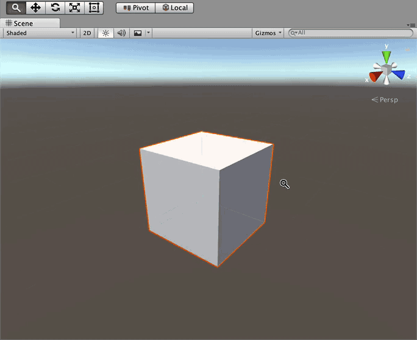

 The _Translate tool_ lets you select and position a GameObject in the scene:

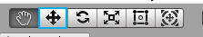

 You’ll notice when you select a GameObject while the Translate Tool is active, you’ll see three colored arrows growing from its center. These arrows indicate the three-dimensional axes of the object: the x-axis is the red arrow, the y-axis is the green arrow, and the z-axis is the blue arrow:

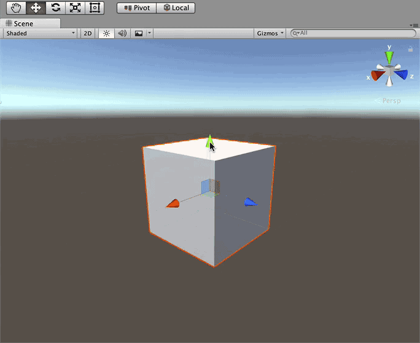

> _Note:_ this group of three colored arrows are known as a _gizmo_ in Unity-speak. A gizmo is 3D geometry or texture that provides information regarding the GameObject.
>
> In this case, the gizmo indicates the direction of each axis. As you learn more about Unity, you’ll be able to add your own gizmos to indicate things.The great thing about gizmos is they’re only displayed in the Scene View, and you can turn them off when they’re no longer needed.

 The third button is the **Rotate Tool**, which lets you rotate any object.

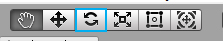

 You’ll notice three spherical colored lines when you select an object to rotate; these lines indicate the axis to rotate around. Simply select the line and drag your mouse to rotate the GameObject. To free rotate without being constrained to an axis, select the space between the lines and move your mouse:

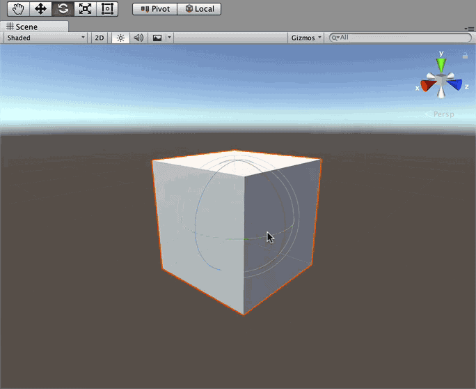

Now try selecting one of the coloured lines and move your mouse to rotate it in that specific axis.

Next is the **Scale Tool**

The _Scale tool_ lets you scale a GameObject either along a single axis, or proportionately on all axes.

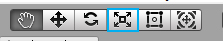

 To scale an object along an axis, select the GameObject then drag the square end of an axis line; the GameObject will scale along that axis. To scale the entire GameObject, select the center point of the GameObject and drag the mouse either forwards or backwards to scale the GameObject up or down respectively:

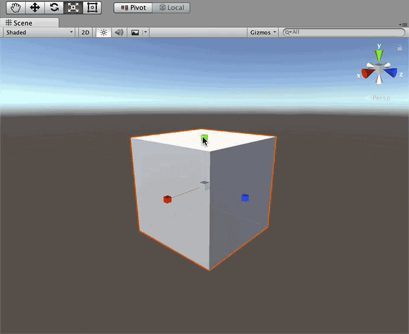

The shortcut keys for the Hand Tool is - Q, Translate is W, Rotate is E, and Scale is R.   
So for any transform control, you can use " Q, W, E and R" to easily get things done.


Got Struck??? Post your Query in this [Facebook Group](https://www.facebook.com/groups/soi.vr/)



## Video Reference

* [Understanding Unity Interference](https://www.youtube.com/watch?v=z92ZfYEyojI) 


