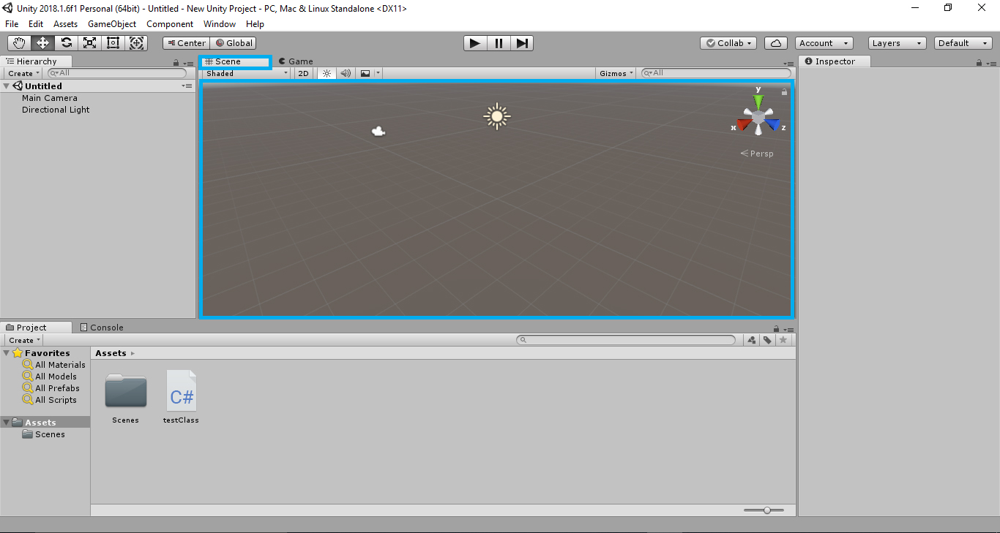
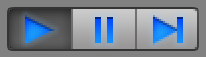

# Unity Interface

The Unity UI can be really intimidating and confusing at first. But do not worry, it is easier to use than it looks. The interface is highly customizable and you can make it look as simple or complex as you want it to be.

On the top right corner you will find 5 buttons, select the last button which would be titled " Layout", Click on it and choose the kind of layout you want for the editor. We will be using the "default" view until the end if this guide-book.

Your editor should now look like the image on top \( in case it had a different layout earlier \).

Now lets check out the different parts of the editor.

### The Scene View

The scene view is where you make your game/vr experience. This is literally your sandbox/workshop you do most of your work here. 

As you make your app, add elements, move things around or make any changes at all, the scene view will update itself real-time.

### The Game View

The game view is where you can try out your game mechanics, see how things are working from a user/player point of view. The game view shows you how the user sees the game.  

### Hierarchy Window

If you have used Photoshop or any 3D Design software, you will find this very familiar. The hierarchy window is where you add and manage your Game objects. 

> Game objects are any objects used in your game or application. Game objects are empty containers to which you can give any parameter or character. Game objects can project geometry \( be a cube or sphere or any kind of shape or mesh \), can emit light, act as a camera or even create complex behaviors via scripts. They can even be used as an empty place holder that can be used as a folder

Whatever you add to the Scene view, it pops up in the hierarchy window and vice versa.

They can even be used as an empty place holder that can be used as a folder. If your projects gets too big with too many objects, you can even search for the Game objects you're looking for.

### The Project Window

The project window contains all the assets you use in your application. You can drag any object into the scene view or hierarchy window when you want to use them in your app/game. When you want to import an asset from your computer to your project, just drag and drop your asset into the project window.

> An asset is anything that you can use in your app / game , like 3D models, images, fonts, videos, meshes, etc. Anything and everything in your project window is an asset.

### Inspector Window

The Inspector window lets you configure any game object in a scene. When you select any game object in the hierarchy window, the inspector lists all of its properties, which you can edit and customize and also add any new component to it. 

### Play Buttons

The play buttons can be found right at the top of the Unity Editor. They let you start and stop the game. The first is the play button.

It starts the game and you notice that the buttons turn blue.

A very important fact to remember is that once you are in play mode, whatever changes you make will not get saved and more over, the changes you make will revert when play mode stops. 

The pause button lets you pause the game at any instant. You can pause at anytime and make changes to your scene and resume.

The third button is called the step button. It lets you step or sweep through each frame in a scene on a frame- by- frame basis.

These are the basics Unity Interface elements that you will be dealing with. To get a better view of things, check out the official [Unity3D Manual](https://docs.unity3d.com/Manual/UnityBasics.html). 


## Video Reference

* [Understanding Unity Interference](https://www.youtube.com/watch?v=z92ZfYEyojI) 



Got Struck??? Post your Query in this [Facebook Group](https://www.facebook.com/groups/soi.vr/)


